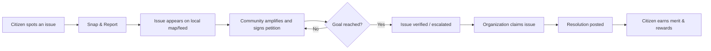

# 🏙️ CitySankalp

> **Spot it. Report it. Amplify it. Resolve it.**

CitySankalp is a mobile-first civic action platform that transforms everyday city complaints into a public, trackable, and rewarding community movement.

Instead of scattered WhatsApp messages, duplicate reports, and slow complaint portals, CitySankalp enables citizens to report issues, mobilize community support, track progress in real time, and earn recognition for improving their neighborhoods.

---

## ✨ Features

- 📍 Report civic issues with location and optional photos
- 🗺️ Browse nearby issues through the Action Center
- 📢 Amplify important issues with community support
- ✍️ Petition system for issue-based escalation
- 📰 Civic Feed with progress and before/after updates
- 🤝 NGOs, CSR teams, citizen groups, and authorities can claim issues
- 🏆 Merit points, leaderboards, and rewards for participation
- ⚡ Real-time updates powered by Supabase

---

## 🔄 Workflow



---

## 🛠 Tech Stack

- **Frontend:** Next.js 16, React 19, TypeScript
- **Styling:** Tailwind CSS
- **Backend:** Supabase (Auth, PostgreSQL, Storage, Realtime)
- **Maps:** Leaflet & React Leaflet
- **Deployment:** Vercel
- **Analytics:** Vercel Analytics

---

## 🚀 Getting Started

### Prerequisites

- Node.js 20+
- npm
- A Supabase project

### Installation

```bash
git clone https://github.com/sinhakrish3-coder/citysankalp.git
cd citysankalp
npm install
```

### Environment Variables

Create a `.env.local` file:

```env
NEXT_PUBLIC_SUPABASE_URL=your_supabase_project_url
NEXT_PUBLIC_SUPABASE_ANON_KEY=your_supabase_anon_key
```

### Database Setup

Run the following SQL files in the Supabase SQL Editor:

- `supabase/schema.sql`
- `supabase/seed.sql`

Create a public storage bucket named:

```
issue-images
```

### Run Locally

```bash
npm run dev
```

Visit:

```
http://localhost:3000
```

### Production Build

```bash
npm run build
npm run start
```

---

## 🗺️ Roadmap

- GPS-based duplicate detection
- AI-assisted issue categorization from images
- Verified NGO & CSR onboarding
- Admin dashboard for moderation
- PostGIS heatmaps and smart ranking
- Sponsor impact reports
- Multilingual support

---

## 👨‍💻 Author

**Krish Sinha**

---

⭐ If you found this project interesting, consider starring the repository.
